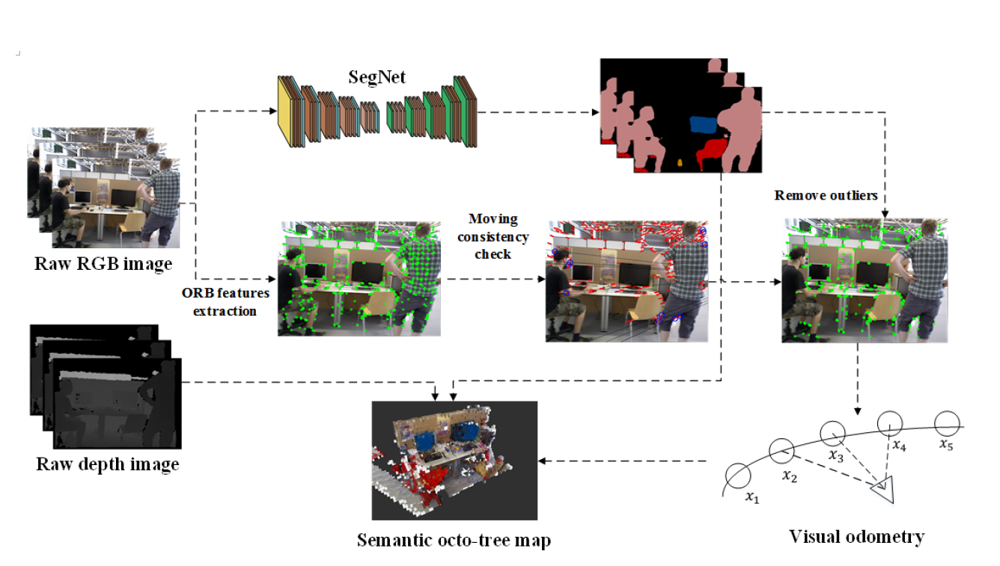

# DS-SLAM: A Semantic Visual SLAM towards Dynamic Environmentsz
作者：Chao Yu, Zuxin Liu, Xin-Jun Liu, Fugui Xie, Yi Yang, Qi Wei, Qiao Fei

机构：清华大学、北航

2018年发表于IROS

主要内容提出了DS-SLAM，基于ORB-SLAM2，五线程并行：跟踪、语义分割、局部地图构建、回环检测、密集语义地图构建。采用实时语义分割和运动一致性检查的方法识别并去除动态物体

所用数据集：TUM RGB-D dataset、real-world environment

## 相关工作
1. Semantic SLAM

2. SLAM in dynamic environments

### 现有方法的不足

- 现有框架不够鲁棒，不能适用于所有的环境之中，如高度动态或者恶劣环境之中。

- 地图模型通常是基于几何学的信息，如基于地标的地图和点云地图，所以它们并不提供对周围环境的任何高层次的理解。

- 光流法检测动态物体虽然很快，但准确度低，计算开销大；根据点的轨迹聚类的方法很鲁棒，但不能实时运行。

## 整体结构

1. 语义分割

所用传感器：Kinect v2

实时语义分割网络采用SegNet(PASCAL VOC数据集训练)，可以分20类。

2. 运动一致性检查

运动分割耗时，语义分割结果可以从另一线程中直接获得。所以只需要考虑运动语义结果上的key points即可。

本文评价自己这种运动点检测的方法是直接的。

流程：
1. 利用光流法获取当前帧中匹配的特征点  
2. 检测特征点匹配是否合法。若太靠近边界，或其像素值，与以它为中心的邻域的3x3区域内的像素值差别太大，就认为不合法，丢弃这对匹配
3. 利用RANSAC方法计算基础矩阵(fundamental matrix)
4. 利用基础矩阵计算极线
5. 判断匹配点极线的距离是否小于确定的阈值，如果大于给定阈值则认为该点在移动之中

建图与回环检测与ORB2相同

摘用：1、However, some problems are still not well solved, for example, how to tackle the moving objects in the dynamic environments, how to make the robots truly understand the surroundings and accomplish advanced tasks.

2、Images store a wealth of information and can be employed for other vision-based applications, like semantic segmentation and object detection.

3、According to [3], SLAM enters the robust-perception age and more research to achieve genuinely robust perception and navigation for autonomous robots is needed.

4、A basic assumption in most current SLAM approaches is that the environment is static. However, active objects like humans, exist in many real-world scenes. Therefore, most state-of-the-art approaches that initially designed for doing SLAM in static environments are not capable of handling severe dynamic scenarios. 

5.In real-world applications, accurate pose estimation and reliability in harsh environments are critical factors to evaluate autonomous robots. ORB-SLAM2 has an excellent performance in most practical situations. Therefore, ORB-SLAM2 is adopted in DS-SLAM to provide a global feature-based SLAM solution that enables us to detect dynamic objects and produce semantic octo-tree map.