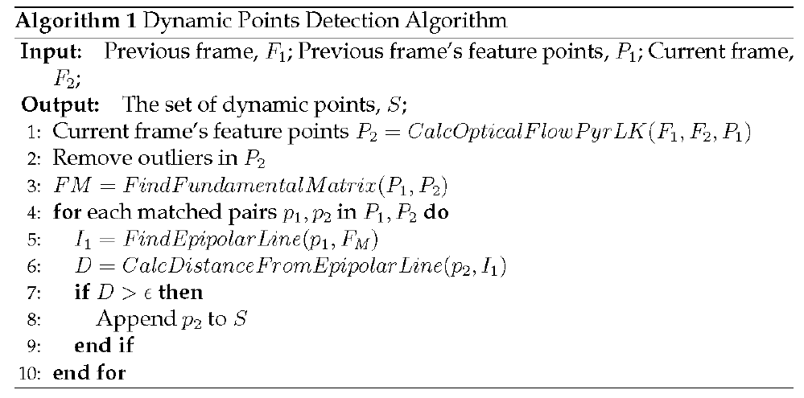
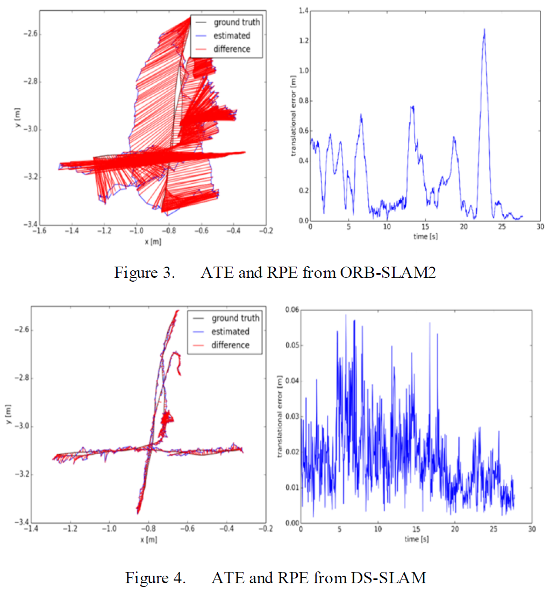
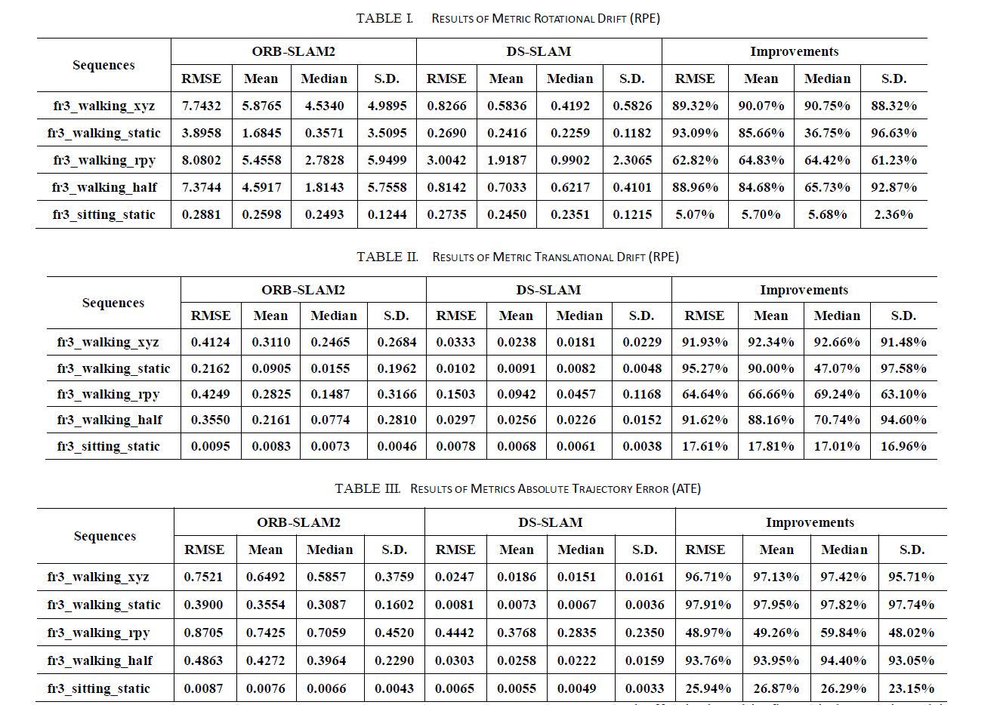
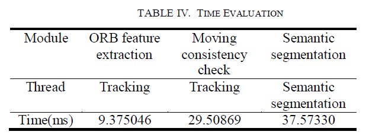
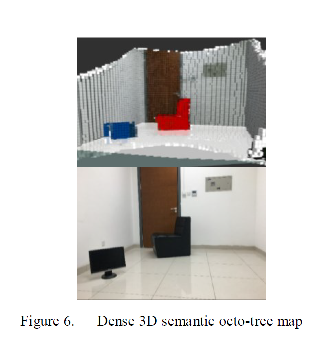
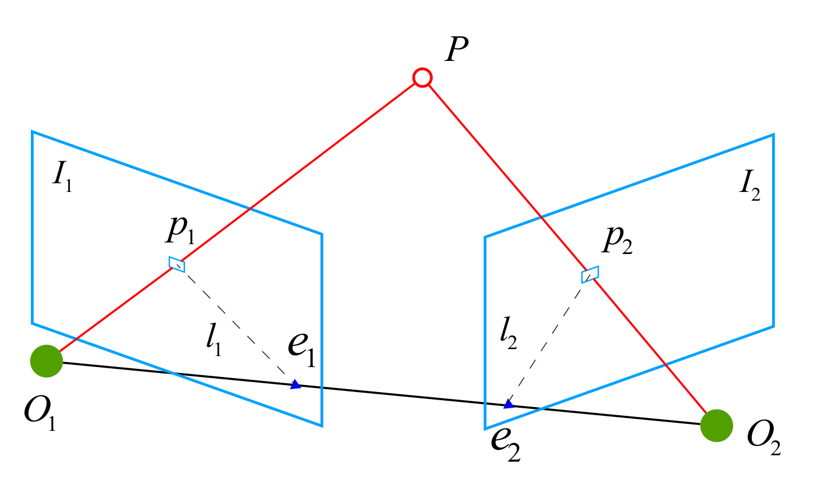

# DS-SLAM: A Semantic Visual SLAM towards Dynamic Environmentsz
作者：Chao Yu, Zuxin Liu, Xin-Jun Liu, Fugui Xie, Yi Yang, Qi Wei, Qiao Fei

机构：清华大学、北航

2018年发表于IROS

主要内容提出了DS-SLAM，基于ORB-SLAM2，五线程并行：跟踪、语义分割、局部地图构建、回环检测、密集语义地图构建。采用实时语义分割和运动一致性检查的方法识别并去除动态物体

所用数据集：TUM RGB-D dataset、real-world environment

## 相关工作
1. Semantic SLAM

2. SLAM in dynamic environments

### 现有方法的不足

- 现有框架不够鲁棒，不能适用于所有的环境之中，如高度动态或者恶劣环境之中。

- 地图模型通常是基于几何学的信息，如基于地标的地图和点云地图，所以它们并不提供对周围环境的任何高层次的理解。

- 光流法检测动态物体虽然很快，但准确度低，计算开销大；根据点的轨迹聚类的方法很鲁棒，但不能实时运行。

## 整体结构

1. 语义分割

所用传感器：Kinect v2

实时语义分割网络采用SegNet(PASCAL VOC数据集训练)，可以分20类。

2. 运动一致性检查

运动分割耗时，语义分割结果可以从另一线程中直接获得。所以只需要考虑运动语义结果上的key points即可。

本文评价自己这种运动点检测的方法是直接的。

流程：
1. 利用光流法获取当前帧中匹配的特征点  
2. 检测特征点匹配是否合法。若太靠近边界，或其像素值，与以它为中心的邻域的3x3区域内的像素值差别太大，就认为不合法，丢弃这对匹配
3. 利用RANSAC方法计算基础矩阵(fundamental matrix)
4. 利用基础矩阵计算极线
5. 判断匹配点极线的距离是否小于确定的阈值，如果大于给定阈值则认为该点在移动之中

数学推导：
1. 前一帧图像上的点p1和当前帧图像上的点p2相匹配，获得他们的齐次坐标:$P1=[u_1,v_1,1],P2=[u_2,v_2,1],p1=[u_1,v_1],p2=[u_2,v_2]$
2. 极线$I_1=\begin{bmatrix}X\\Y\\Z\end{bmatrix}=FP_1=F\begin{bmatrix}u_1\\v_1\\1\end{bmatrix}$
3. 点$P2$到极线$l_2$的距离公式$D=\frac{|P_2^TFP_1|}{\sqrt{||X||^2+||Y||^2}}$
4. 自定义阈值$\epsilon$与D进行比较

算法流程：

3. 外点剔除

利用运动一致性检查提取物体边缘轮廓比较复杂，但是由于语义分割网络的使用，物体的轮廓提取变得十分简单，所以建立一个两层语义：运动or不运动。

如果一个物体中达到一定数量的运动点则认为他是运动的，如果一个物体被认为是运动的，则移除这个轮廓内的所有点。

错误分割结果的影响也会在一定程度上减少。

4. 密集语义的3D八叉树地图构建

八叉树地图灵活、紧凑和便于更新，更加容易用于导航。

八叉树中的每一个体素的颜色都表示一种语义 &ensp; e.g. 红色表示沙发，粉色表示人。

由于DS-SLAM是用于解决动态环境问题的，所以动态物体不会被保存在地图之中。采用优势对数记分法（log odds score）计算体素被占用的概率：

$p$表示体素被占用的概率，$l$表示优势对数记分法的概率&ensp; $l=logit(p)=log(\frac{p}{1-p})$

所以$p=logit^{-1}(l)=\frac{exp(l)}{exp(l)+1}$

$Z_t$表示体素n在t时刻的观测结果，他的优势对数记分从开始到t时刻用$L(n|Z_{1:t})$表示

在t+1时刻，$L(n|Z_{1:t+1})=L(n|Z_{1:t-1})+L(n|Z_{t})$

如果体素n被占用，则$L(n|Z_{t})$为固定值$\tau$,否则则为0.所以如果观测到一个体素被重复占用，他的得分就会增加，否则就会减少。

再通过逆运算计算体素被占用的概率p，再与给定阈值进行比较，最终在八叉树地图中展示出来。

## 实验部分

实验数据集：TUM RGB-D和现实场景

评价指标：RMSE(均方根误差), Mean Error, Median Error(平均误差) and Standard Deviation (S.D.  标准差)

其中RMSE和S.D.更受关注，因为它们可以更好地表明系统的鲁棒性和稳定性

相机运动方式：xyz(相机沿xyz轴方向移动)、rpy(方位角)、static、half(???)

ABSOLUTE TRAJECTORY ERROR (ATE)  绝对轨迹误差

RELATIVE POSE ERROR (RPE)  相对姿势误差

实验包括：轨迹与真值对比、位姿与真值对比、评价指标对比、计算开销以及真实场景实验图

八叉树建图效果：

本工作的不足之处：
1. 语义识别中物体的类别受限制；
2. 八叉树地图在回环时必须重新构建；

摘用：1、However, some problems are still not well solved, for example, how to tackle the moving objects in the dynamic environments, how to make the robots truly understand the surroundings and accomplish advanced tasks.

2、Images store a wealth of information and can be employed for other vision-based applications, like semantic segmentation and object detection.

3、According to [3], SLAM enters the robust-perception age and more research to achieve genuinely robust perception and navigation for autonomous robots is needed.

4、A basic assumption in most current SLAM approaches is that the environment is static. However, active objects like humans, exist in many real-world scenes. Therefore, most state-of-the-art approaches that initially designed for doing SLAM in static environments are not capable of handling severe dynamic scenarios. 

5.In real-world applications, accurate pose estimation and reliability in harsh environments are critical factors to evaluate autonomous robots. ORB-SLAM2 has an excellent performance in most practical situations. Therefore, ORB-SLAM2 is adopted in DS-SLAM to provide a global feature-based SLAM solution that enables us to detect dynamic objects and produce semantic octo-tree map.

### 参考：

#### 摘要
本文从齐次坐标开始说起，介绍齐次坐标中点的表达方式，齐次坐标中点在直线上的表述，然后载介绍本质矩阵(基本矩阵)的物理意义，最后介绍怎么求极线。

#### 动机
网上没看到很好说明对极约束的资料，许多资料都说本质矩阵(基本矩阵)描述了两个相机间的对极约束，但是都没说清楚它们的几何意义（至少不能让我很好的理解），因此自己总结一下。

#### 齐次坐标中点的表示方法
一个点坐标换成齐次坐标表示可以简单理解为在最后加一个维度，该维度值为1。例如：

设有一个坐标

$( x , y ) − > ( x , y , 1 )$

$( x , y , z ) − > ( x , y , z , 1 )$

齐次坐标中点在直线上的表示方法

在二维平面上，一条直线l可以用直线方程 $a x + b y + c = 0$来表示（这里x, y 是变量），我们还可以用向量来表示一条直线：

$l = ( a , b , c )^T$
 
已知一个具体位置的点 $p ( x_0 , y_0)$，若该点在直线l上，则有$a x_0 + b y_0 + c = 0$

当我们改用齐次坐标表示点 $p ( x 0 , y 0 , 1 )$,那么该点在直线 l上的表示可以用向量表述：
$pl = 0$

因此，改用齐次坐标表示一个点后，判断该点在不在一条直线上的方式，变成判断等式 $pl = 0$是否成立，或者说点 p与 l 的内积是否为0。

基本矩阵的物理意义以及极线的求法
如下图，$O_1 、 O_2$是两个相机光心在三维空间中的位置， P为三维空间中一个点；$O_1 、 O_2、P$三点所确定的平面，与两个相机成像平面 $I_1 、 I_2$相交于四个点；其中，$p_1 、 p_2$为点 P在两个相机成像平面 $I_1 、 I_2$上的投影，$e_1 、 e_2$为直线$O_1 、 O_2$与两个相机成像平面$I_1 、 I_2$的两个交点。其中

基线：$O_1 、 O_2$所确定的线段

极平面：$O_1 、 O_2、 P$三点所确定的平面

极点：点$e_1 、 e_2$

极线：$p_1 、 e_1$所确定的直线 $l_1$以及 $p_2 、 e_2$所确定的直线$l_2$

对于 $p_1 = ( u_1 , v_1 , 1 )^T , p_2 = ( u_2 , v_2 , 1 )^T$，基本矩阵 F ，根据对极约束有
$p_2^TFp_1 = 0$

回顾上面齐次坐标中点在直线上的表示方法，我们可以知道点 $p_2$在直线 $Fp_1$上，因此直线$Fp_1$就是我们所说的极线，且该直线为上图中的极线$l_2$。通过类比可得另一条极线为
$l_1 = F^{− 1}p_2$