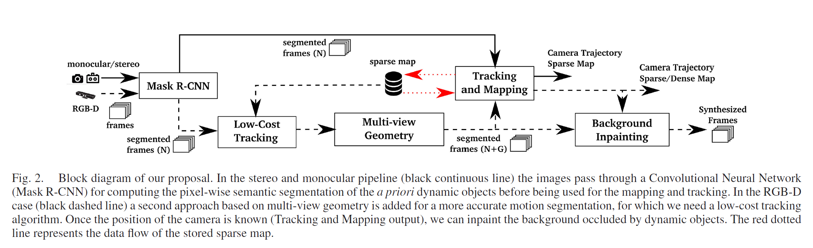
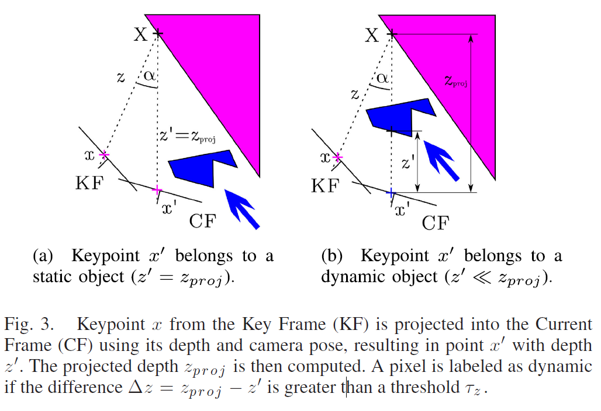
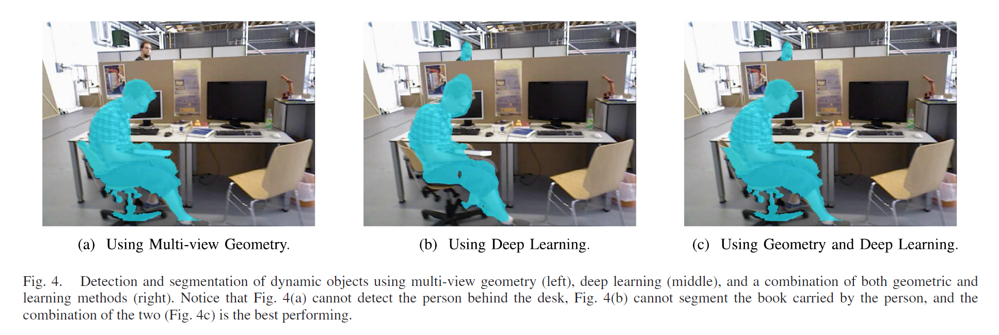
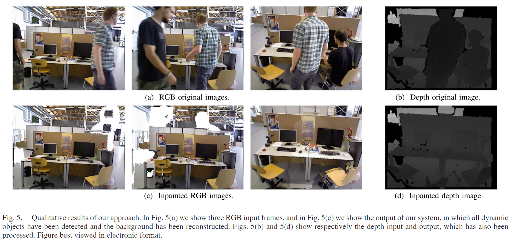

# DynaSLAM: Tracking, Mapping, and Inpainting in Dynamic Scenes
作者：Berta Bescos , Jos´e M. F´acil , Javier Civera , and Jos´e Neira

机构：萨拉戈萨大学

2018年发表于RAL

主要内容提出了视觉的DynaSLAM，基于ORB-SLAM2添加了一个前端,具有检测动态物体和背景图像修复的功能。支持单目、双目、RGB-D相机。可以通过多视角几何、深度学习以及两者一起的方式来检测动态物体；并建立剔除了动态物体且背景贴图后的静止地图。

所用数据集：TUM RGB-D dataset、real-world environment

## 现有方法的不足

1. 如何在图像中检测动态物体：
<ul>
<li> 防止跟踪算法匹配属于动态物体的部分。

<li> 防止制图算法将移动的物体作为3D地图的一部分。
</ul>

2. 如何完成三维地图中被移动物体遮挡的部分

最经典的离群点剔除方法是RANSAC(ORB-SLAM、PTAM)

## 整体结构

语义分割的采用Mask R-CNN的分割方法逐像素分割，分割结果是先验的。如果动态目标不在语义分割的类别之中，那么采用多视角几何的方法检测。

在完成动态目标检测、定位相机位姿后，下一步利用之前的视图重建当前帧剔除了动态目标的背景部分。
<ul>

1. 使用CNN对潜在的动态内容进行分割（详细解释了网络的训练数据，分割类别以及输入、输出）

Mask R-CNN:可以获得像素尺度的语义分割结果以及实例标签。本工作不需要使用实例标签，在未来的工作中可能会用到。

潜在运动目标：人，自行车，汽车，摩托车，飞机，巴士，火车，卡车，船，鸟，猫，狗，马，羊，牛，大象，熊，斑马和长颈鹿

如果出现列表外的动态目标，利用MS COCO数据集训练可以完善

2. 低成本跟踪（Low-Cost Tracking）

相机的位姿可以利用图像中静止的部分计算获得，因为动态目标的边缘是高梯度的区域，总是出现显著的点特征，所以一般会忽略掉这种边缘区域的特征。这种方法计算开销很小。

3. 利用Mask R-CNN和多视点几何对动态内容进行分割

出现列表外的动态目标,如被人携带着移动的图书。

方法：
<ul>
<li> 对于每一阵输入影像，选取重叠区域最多的5帧关键帧，这是为了在精度和计算开销之间折中。
<li> 计算之前关键帧中每一个关键点$x$在当前帧的投影，获得点$x'$。并且利用相机的运动计算出深度$z_{proj}$。关键点x在三维空间对应的点为X。
<li> 计算$x$和$x'$之间的角度$\alpha$,如果角度大于$30^\circ$ ,那么该点可能会被剔除。（作者在TUM数据集中验证，如果角度大于$30^\circ$，那么由于视角差异，静态物体被认为是动态的）
<li> 提取当前帧$z'$中其余关键点的深度（直接利用深度测量获取）
<li> 计算重投影误差，并与$z_{proj}$比较。如果$\triangle z=z_{proj}-z'$超过阈值$\tau$,那么$x'$被认为是属于动态物体的.$\tau$的选择标准是在TUM数据集上设置不同的$\tau$，利用评价标准$0.7*Precision+0.3*Recall$获得，最终发现$\tau=0.4m$是最好的选择。
</ul>

4. 跟踪与建图

输入是RGB-D图像和分割的mask结果，提取静态物体的ORB特征点，分割边缘是高梯度地区，位于这上面的关键点会被移除。

5. 背景重绘

把以前所有关键帧的RGB和深度通道投射到当前帧的动态分割的区域中。会产生一些空隙没有对应关系，因此留有空白。这些空白无法用几何方法重建，所以需要一个更复杂的涂抹技术。

重绘结果如下：

6. 实验部分

Microsoft Kinect sensor采集，30HZ，可以获得RGB图像和深度信息，并利用高精度的动捕设备获取轨迹真值。
</ul>

摘用：1、However, the vast majority of the approaches and datasets assume a static environment.

2、For detecting dynamic objects we propose to use a CNN that obtains a pixel-wise semantic segmentation of the images.

3、

4、
