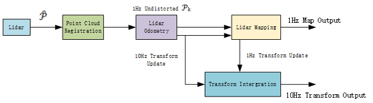

# LOAM: Lidar Odometry and Mapping in Real-time论文笔记
作者：Ji Zhang and Sanjiv Singh

2014年发表于RSS

## 总览

首先匹配问题分为scan-to-scan、scan-to-map、map-to-map三类。

- scan-to-scan匹配

    即两帧激光雷达数据之间的匹配，目的是求得从起始帧A到目标帧B的相对平移量与旋转矩阵。目前来说scan-to-scan中，匹配效果最好的方法是ICP（Iterative Closest point迭代最邻近点算法）优点是计算量小速度快，缺点是误差累计大，长距离误差累计后地图就无法看了。
- map-to-map的匹配

    即地图与地图之间的匹配，优点是精度高，误差累计小；缺点就是计算量大，实时性压力大。

- scan-to-map的匹配
    即激光雷达扫描数据直接与地图进行匹配，这种方式一边计算位置，一边把新扫描到的数据及时加入到已有的地图中。他的优缺点都比较适中。

LOAM是基于激光雷达而搭建的在ROS平台下的SLAM系统，一共分为四个部分：

LOAM的核心在于**特征提取（Lidar Registration）** 和**里程计解算（Odometry and Mapping）。**
同时，LOAM的特点也就是很好地结合了前两种匹配方法的优点，他首先是获得激光雷达坐标系下的点云数据$P$，然后把第$k$次扫描获得的点云组成一帧数据$P_k$。然后将$P_k$送入Liar Odometry节点和Lidar Mapping节点中进行处理。
- Liar Odometry节点的作用是获取两帧连续点云数据间的运动，估计出来的运动用于去除$P_k$中的运动畸变。这个节点执行的频率为10Hz，相当于scan-to-scan匹配，获得粗糙的运动估计用于去除运动造成的运动畸变。
- 处理后没有运动畸变的点云结果传到Lidar Mapping节点与地图进行匹配，相当于一次map-to-map的匹配，由于计算量比较大，所以频率降低为1HZ。最后由Transform integration节点接收前面两个节点输出的Transform信息并将其进行融合处理以活动频率为10Hz的里程计。

总的来说，虽然scan-to-scan匹配精度差但是计算量较小因此我们可以高频执行进而实现**粗定位**。虽然map-to-map计算量大但是我们可以让其执行的频率降低实现**精定位**。这样的高低频率结合的里程计就保证了计算量的同时又兼具了精度。

## 符号预定义
- $P_k$表示第$k$次扫描期间感知到的点云。

- 激光雷达坐标系{ $L$ }是三维坐标系，原点是激光雷达的中心，$x$轴向左，$y$轴向上，$z$轴向前。激光雷达坐标系中的点$i$，$i \in P_k$被表示为$X^L _{(k,i)}$

- 世界坐标系{ $W$ }是三维坐标系，原点是激光雷达坐标系的起始原点位置，$x$轴向左，$y$轴向上，$z$轴向前。激光雷达坐标系中的点$i$，$i \in P_k$被表示为$X^W _{(k,i)}$

**任务描述**

**Problem: Given a sequence of lidar cloud $P_k$ , $k∈ Z^+$ , compute the ego-motion of the lidar during each sweepk, and build a map with $P_k$ for the traversed environment.**

**问题: 给定一个激光点云序列$P_k$ , $k∈ Z^+$，计算每次扫描时激光雷达的自运动，用$P_k$构建遍历环境的地图。**

## 1.特征点提取

在一次扫描的scan数据中点的分辨率为0.25度，并且这些点分布在一个扫描平面上。然而固定激光雷达的轴的转速为180度每秒。而激光的频率为40Hz，因此这个轴上点的分辨率为4.5度。考虑到点云数据的非均匀性，采取从一次scan中获取特征点。

作者定义了一个**平面光滑度**作为提取当前帧的特征信息的指标。

平面光滑度在代码中的实现更为简单，抛弃前面的部分，只需要计算当前点和前后五个点，就可以得到对应的平滑度数据，非常有效的降低了计算量。

 基于平面光滑度的值的大小，将特征点划分为两大类：**平面点**和 **边缘点**。
 - 平面点：在三维空间中处于平滑平面上的点，其和周围点的大小差距不大，曲率较低，平滑度较低。
 - 边缘点：在三维空间中处于尖锐边缘上的点，其和周围点的大小差距较大，曲率较高，平滑度较高。

对集合内的点进行排序，找到最小的点$c$作为平面点，最大的点$c$作为边缘点。

特征点的选取约束：
1. 不能超过设定的size，每个集合平面点4个，边缘点2个；
2. 已选取的点周围不能有点，使得点可以分布的更加均匀；
3. 选取的平面点不能与激光扫描束平行。
4. 避免选取可能被遮挡的点

上述3.中的证明过程：

上述4.中的证明过程：

特征点提取结果：

## 2.特征点匹配
### 符号预定义
|  符号  | 含义  | 解释  |
|  ----  | ----  | ----  |
| $t$ | current time stamp | 当前时间戳 |
| $𝑡_{(𝑘+1)}$ | starting time of sweep $𝑘+1$ | 第$k+1$次扫描的开始时间 |
| $𝑖$ | a point, $𝑖 \in 𝑃_(𝑘+1)$ | 点$i$ |
| $𝑇_{(𝐾+1)}^𝐿$ | lidar pose transform between $[𝑡_{(𝑘+1)}, 𝑡]$ | $𝑡_{(𝑘+1)}$到 $𝑡$时刻的旋转矩阵 |
| $𝑇_{(𝑘+1,𝑖)}^𝐿$ | lidar pose transform between $[𝑡_{(𝑘+1)},𝑡_𝑖]$ | $𝑡_{(𝑘+1)}$到 $t_i$时刻的旋转 |
|  $E_K$  | edge points  | 边缘点  |
|  $H_K$  | planar points  | 平面点  |
|  $\overline{P_K}$  | $P_k$ is reprojected point cloud as $\overline{P_K}$  | $P_k$被重投影到t+1时刻  |
|$\widetilde E_{k}$ | $E_{K}$ is reprojected point cloud as $\widetilde E_{k}$  | $E_{K}$被重投影到t+1时刻  |
|$\widetilde E_{k+1}$ | $E_{K+1}$ is reprojected to the beginning of the sweep  | $E_{K+1}$被重投影到$k+1$次扫描开始的时刻  |

**即：处理过的点云，都会投影到结束时刻的坐标系下，而当前收到的点云数据会投影到起始时刻的坐标系下。这样处理过的点云和当前收到的点云才会处于在同一个坐标系下。**

重投影点云到每次扫描的结束位置，蓝色线段表示第$k$次扫描的点云，$P_k$.$P_k$被投影到$t_{k+1}$时刻获得 $\overline{P_K}$（绿色线段部分），在第$k+1$次扫描的时候，$\overline{P_K}$和新获得的点云$P_{k+1}$一起用来估计激光雷达的运动。

### 2.1边缘点匹配
已知信息：$\widetilde E_{k+1}$和$E_k$

从$\widetilde E_{k+1}$中选取边缘点$i$，在$E_k$中选取与$i$最近的点$j$，并$E_k$中选取与点$j$相邻的扫面线中的最近的点$l$（这样做的原因是方式$i，j，k$共线而无法构成三角形）如下图所示：

因此，选取了三个点: { $i \in \widetilde E_{k+1},j,l \in E_K$ }，坐标分别记为： $\widetilde X_{(k+1,i)}$,$X_{(k,j)}$ 和 $X_{(k,l)}$ 。

点$i$到线$jl$的最短距离为：

至此，边缘特征点$i$找到对应点即为$(j,l)$

### 2.2平面点匹配
同理，从$\widetilde H_{k+1}$中选取平面点$i$，在$H_k$中选取与$i$最近的点$j$，并$H_k$中选取与点$j$相同的扫描线中的最近的点$l$,然后在$H_k$中选取与点$j、l$相邻的扫描线中的最近的点$m$如下图所示：

点$i$到面$jlm$的最短距离为：

至此，平面特征点$i$找到对应点即为$(j,l,m)$

**疑惑：为什么LOAM的特征点匹配不采用更直接计算点-点的距离，而是采用点-线和点-面的匹配。**

我能找到的回答（不一定正确而且不太理解）：因为激光点的稀疏性相邻两帧的点云很多程度上不同扫描但相同的位置，只能近似认为是相近位置。

### 2.3姿态解算
残差项即为求出的$d_E$和$d_H$,优化即最小化$d_E$和$d_H$，可以利用非线性优化来求解。

已知：$X_{k+1}=RX_k+T$

假设雷达的自身运动是匀速运动，所以，我们获取了每个点的时间戳信息，并使用线性方程，得到每个时刻对应的姿态变换矩阵，这一步主要是进行了**运动补偿**。

$T^L_{k+1}=[t_x,t_y,t_z,\theta_x,\theta_y,\theta_z]^T$

我们首先求解第$k+1$ 帧中第$i$个点的姿态变换信息：
$T^L_{(k+1，i)}=\frac{t_i-t_{k+1}}{t-t_{k+1}}T^L_{k+1}$

$T^L_{(k+1，i)}$即为$[t_{k+1},t_i]$之间的位姿变换，通过线性插值来求解获得。

回想，$E_{k+1}$和$H_{k+1}$是从$P_{k+1}$中提取的边缘点和平面点集合，而$\widetilde E_{k+1}$和$\widetilde H_{k+1}$是重投影到$k+1$次扫描开始的集合。如何建立$E_{k+1}$到$\widetilde E_{k+1}$与$H_{k+1}$到$\widetilde H_{k+1}$的关系：

$X^L_{(K+1,i)}=R\widetilde X^L_{(k+1,i)}+T^L_{(k+1,i)}(1:3)$

注释：$T^L_{(k+1,i)}(1:3)$为$T^L_{(k+1,i)}$的1~3条，即$t_x,t_y,t_z$,平移矩阵，而 $R$是由罗德里格斯公式定义的旋转矩阵。

$\theta$是旋转的角度，$\theta=||T^L_{(k+1,i)(4:6)} ||$

$w$表示旋转方向的单位向量      $w=T^L_{(k+1,i)(4:6)}/||T^L_{(k+1,i)(4:6)}$

$\hat{w}$是$ω$的斜对称矩阵。

根据$d_E$与$d_H$和上述公式可以推导得到：
$f_E(X^L_{(k+1，i)},T^L_{k+1})=d_E,i \in E_{k+1}$和$f_H(X^L_{(k+1，i)},T^L_{k+1})=d_H,i \in H_{k+1}$

总结一下获得$f(T^L_{k+1})=d$

然后就是求解这个非线性优化的问题，使用常规的列文伯格-马夸特法(LM)来进行求解。
(需要学习一下LM法)A-LOAM中是利用ceres库进行求解的。

**算法流程**

input：$\overline{P_K}$，$P_{k+1}$,$T^L_{k+1}$
1. 当开始新的扫描时，$T^L_{k+1}$被置为$0$，然后从$P_{k+1}$中提取边缘点和平面点，获得$E_{k+1}$和$H_{k+1}$（1-7）
2. 开始循环：按照特征点匹配，寻找$E_{k+1}$和$H_{k+1}$在上一帧中的对应关系。（9-14）
3. 为每一个特征点分配一个权重，与对应点距离大的特征点权重小，与对应点距离小的特征点权重大，对距离大于阈值的特征点视为异常值并分配零权重。（15）
4. 根据下图公式，更新位姿变换$T^L_{k+1}$

5. 如果非线性优化收敛或满足最大迭代次数，那么循环结束
6. 如果算法到达扫描结束时，则重投影${P_K}$中的每个点到$t_{k+2}$，形成$\overline{P_{k+1}}$，返回
$\overline{P_{k+1}}$和$T^L_{k+1}$
7. 否则，下一轮递归只返回$T^L_{k+1}$

## 3.激光建图

当我们获取了若干相邻帧的姿态变换信息后，我们需要做的就是将其和全局地图进行匹配，并将其加入到全局地图之中。

该算法以一个较低的频率执行，每次扫描只执行一次。在扫描$k+1$的结束，激光里程计产生的无畸变的点云$\overline{P_{k+1}}$，同时生成一个$[t_{k+1},t_{k+2}]$之间的姿势变换$T^L_{k+1}$。

建图算法的目的就是将$\overline{P_{k+1}}$在世界坐标系$\{ W \}$中对齐，为此我们提前设定：
- 第 $k+1$ 帧之前的扫描点云在全局坐标系下的投影为 $Q_k$ ；
- 第 $k$ 次扫描的末位，也就是$k+1$ 帧的起始时的姿态变换信息 $T_k^L$ 。
- 利用Odometry的输出$T^L_{k+1}$ ，将$T_k^W$从 $k+1$ 时刻的起始推演到 $k+2$ 时刻的起始，得到姿态矩阵$T_{k+1}^W$ 。
- 通过$T_{k+1}^W$，将之前第 $k+1$ 帧的点云投影到全局坐标系下，记为 $\hat{Q_{k+1}}$ 。

目的就是求解精准的$T_{k+1}^W$，以便将 $Q_k$ 和$\hat{Q_{k+1}}$合并。这一步相当于一次map-to-map的匹配，因为$\hat{Q_{k+1}}$是10帧Odometry的输出数据。

这一步的原理也与Lidar Odometry（特征点匹配部分）相近，都是已知两个点云，求得位姿变换矩阵。

为了避免低效的计算效率，$Q_k$并不是真正的全局地图，而是**一个边长为10m的立方体**，用以代替全局地图，优化得到最终的姿态变换矩阵$T_{k+1}^W$。

立方体中与$\hat{Q_{k+1}}$相交的点被提取出来存储在一个**3D KD树**中。并在$Q_k$中寻找特征点一定范围内的点，设$S'$为一组周围点集合，针对平面点和边缘点又有两种处理方法：

- 平面点： $S'$只保留平面特征点；
- 边缘点： $S'$只保留边缘特征点。

$S'$的协方差矩阵为$M$，$M$的特征值为$V$，$M$的特征向量为$E$
- 如果$S'$分布在边缘上，那么$V$中的特征值就会有一个明显大于其他两个，$E$中与较大特征值相对应的特征向量代表边缘线的方向。**（一大两小，大方向）**

- 如果$S'$分布在平面上，那么$V$中的特征值就会有一个明显小于其他两个，$E$中与较小特征值相对应的特征向量代表平面的方向。**（一小两大，小方向）**

可以清楚地看到，特征向量的长度反应了点的分布，也就是说我们**根据特征值和特征向量就能计算出直线的方向**。平面也是同理，我们可以**根据两个较长的特征向量计算平面的法向量，三个向量相交于几何中心，这样平面就确定了。**
通过这种方法就可以快速的确定对应的**边缘线**和**平面**了。（需要了解协方差矩阵，特征向量，特征值的知识，以及为什么可以这样表示出来方向）

这样就可以快速的找到$\hat{Q_{k+1}}$中的一个点 $i$，和 $Q_k$ 中的边缘点{$j，l$}以及平面点{ $j,l,m$ }。然后利用之前计算点到线与平面的距离公式来计算距离，进而求解$T_{k+1}^W$。

- 蓝色区域部分用于mapping算法，低频，用于获得$T^W_{k+1}$
- 橘色区域部分用于Odometry算法，高频，用于计算出$T^L_{k+1}$

为了均匀分布$\hat{Q_{k+1}}$中的点，地图点云通过体素网格过滤器缩小为体素大小为5cm的立方体（下采样，每个立方体中保留一个点）

**优点：**
- 新颖的特征提取方式（边缘点和平面点）
- 运动补偿（时间戳）
- 融合了scan-to-scan（odometry）和map-to-map（mapping）的思想
  
**缺点：**
- 没有后端优化（年代）
- 不能处理大规模的旋转变换（旋转向量的求解）
- 没有加入IMU，运动估计的漂移可以继续减小。
