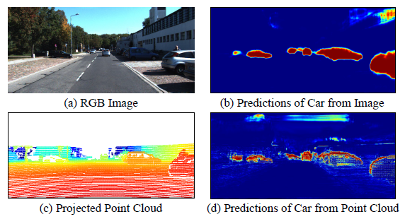

# Perception-Aware Multi-Sensor Fusion for 3D LiDAR Semantic Segmentation论文笔记

作者：Zhuangwei Zhuang， Rong Li， Kui Jia 

机构：华南理工大学、琶洲实验室、深圳佑驾创新科技有限公司

2021 IEEE/CVF International Conference on Computer Vision (ICCV)

## 原文用词
modalities(模态)来表示RGB图像和point clouds两种信息。

## 思路分析

语义分割的经典方法如下：

1. Camera-only methods:得益于开源数据集丰富，RGB图像拥有丰富的颜色、纹理等表征信息，该方法可以提供准确的语义分割结果。

    挑战主要在于：作为被动传感器，相机容易受到光照的影响导致语义分割结果不可靠。

    现有工作：Segnet、Deeplab、DeepLabv3、Ocnet

2. LiDAR-only methods:相比Camera-only methods对于不同的光照情况更加鲁棒，并且可以提供准确的空间几何信息。

    挑战主要在于：点云的稀疏性和不规则性。并且点云缺少纹理和RGB信息，所以在细粒度的语义分割中容易出现错误。

    现有工作：直接法：Randla-net、PointNet、PointNet++、Cylinder3D;投影法:Salsanet、Salsanext、Squeezeseg、PolarNet

加一个投影分类。

a为RGB图像，b为图像中对汽车的预测，c为点云投影图像，d为点云中对汽车的预测，红色为预测得分较高的区域

 

所以为了解决上述两种问题的缺点，很直观地就可以想到融合两种传感器。

现有工作RGBAL、Pointpainting等,都是将RGB图像的特征投影到点云空间中进行融合,但是由于点云的稀疏性,会导致很多RGB图像的特征在投影到点云空间后消失。

本文认为,来自 RGB 图像的外观信息和来自点云的深度信息在多传感器融合的语义分割中都很重要。所以提出了Perception-Aware Multi-Sensor Fusion(PMF),主要贡献如下:

1. 提出了一种透视投影，将点云投影到相机坐标系，以获得 RGB 图像的额外空间深度信息。

2. 提出了一个双流网络(two-stream network, TSNet),分别从两种模态中提取特征.考虑到来自图像的信息在室外环境中不可靠，我们通过有效的基于残差的融合 (RF) 模块将图像特征融合到 LiDAR 流中。

3. 提出了一种额外的感知损失来衡量两种模态的感知差异,并促进不同感知信息的融合。

本文所使用的数据集是两个benchmark datasets，其中一个为nuScenes。

## 本文方法

### 透视投影

#### 符号预定义
|  符号  | 含义  | 解释  |
|  ----  | ----  | ----  |
| $\{P,X,y\}$ | training sample | 训练样本 |
| $P \in R^{4 \times N}$ | a point cloud from LiDAR | 激光点云 |
| $4$ |3D coordinates (x, y, z) and a reflectance value (r)|三维坐标$\{x,y,z\}$和反射率$r$|
| $N$ |the number of points|点云的个数|
| $X \in R^{3 \times H  \times W}$ |an image from an RGB camera|RGB图像|
| $H$ |height of the image|图像的高|
| $W$ |width of the image|图像的宽|
| $y\in R^N$ |semantic labels for point cloud P|点云P的语义标签集|
| $T \in R^{3 \times 4}$ |the projection matrix from LiDAR coordinates to camera coordinates|从激光雷达坐标系到相机坐标系的投影矩阵|
| $R \in R^{4 \times 4}$ |expanded from the rectifying rotation matrix|增加一列后的旋转矩阵|

目的则是获取2D LiDAR 特征$\widetilde{X} \in {R^{C \times H \times W}}$,$C$表示投影点云的通道数。

给$P_i$加1列获得$P_i=(x,y,z,1)^T$,然后通过公式$\widetilde{P_i}=TRP_i$计算$\widetilde{P_i}=(\widetilde{x},\widetilde{y},\widetilde{z})^T$

可以获得点云对应的像素坐标$h=\widetilde{x}/\widetilde{z}$,$w=\widetilde{y}/\widetilde{z}$。

所以就有5通道的激光点云特征$(d,x,y,z,r)$,$d=\sqrt{x^2+y^2+z^2}$表示深度值，$x,y,z$表示空间坐标

### PMF架构

#### 符号预定义
|  符号  | 含义  | 解释  |
|  ----  | ----  | ----  |
| $\widetilde{M}$ | LiDAR stream | LiDAR流 |
| $M$ | camera stream | 相机流 |
| $\widetilde{O}$ | the output probabilities of the LiDAR stream | LiDAR流的输出概率 |
| $O$ | the output probabilities of the camera stream | 相机流的输出概率 |
| $S$ | the number of semantic classes | 语义类别数量 |

由于图像和点云是不同模态的数据，所以很难通过单个网络来处理来自两种模态的两种类型的信息，所以提出双流网络。

$$ 
\begin{cases}
O=M(X)\\
\widetilde{O}=\widetilde{M}(\widetilde{X})
\end{cases}
$$

基于残差的融合模块

由于RGB图像包含很多细节信息，所以该模块的目的是将这些互补特征融合到LiDAR流中

$\{F_l \in R^{C_l \times H_l \times W_l}\}^L_{l=1}$表示图像流的特征。$l$表示获得特征的层数。$C_l$表示第$l$层的通道数。$H_l$和$W_l$表示第$l$层特征图的高度和宽度。

$\{\widetilde{F_l} \in R^{\widetilde{C_l} \times H_l \times W_l}\}^L_{l=1}$表示LiDAR流的特征。

首先连接来自每个网络的特征，并使用卷积层来减少融合特征的通道数。

$F_l^{fuse}=f_l([\widetilde{F_l};F_l])$ 

$[ \cdot; \cdot]$表示连接操作。$f_l( \cdot)$表示第l层的卷积操作.

$F_l^{out}=\widetilde{F_l}+\sigma(g_l(F_l^{fuse}))⊙F_l^{fuse}$

$\sigma(x)=1/(1+e^{-x})$激活函数

$g_l(\cdot)$表示第l层融合模块的注意力模块中的卷积操作

⊙表示逐元素乘法

### 构建感知差异

