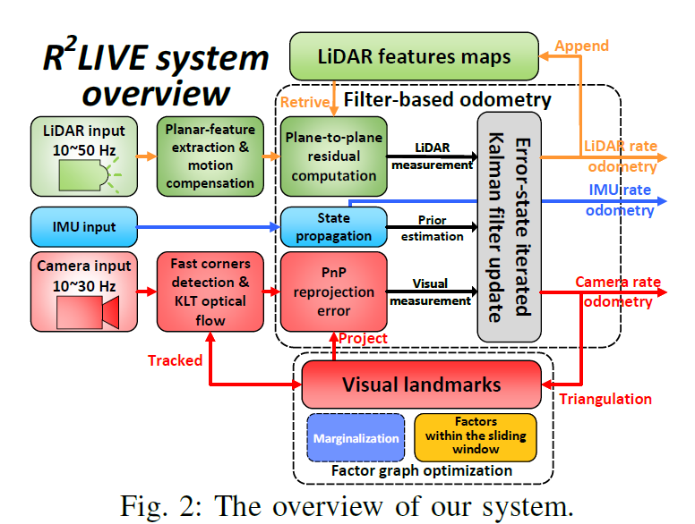
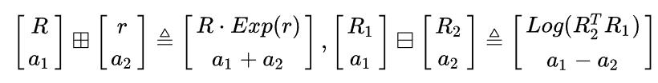
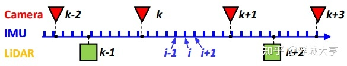
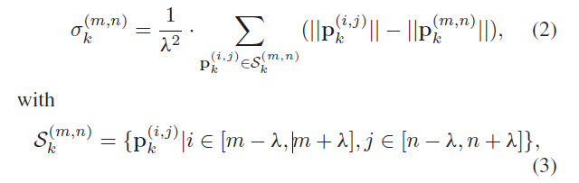

# R2LIVE: A Robust, Real-time, LiDAR-Inertial-Visual tightly-coupled state Estimator and mapping 论文笔记
作者：Jiarong Lin, Chunran Zheng, Wei Xu, and Fu Zhang

2021年发表于IEEE Robotics and Automation Letters

## 总览
- 本文提出一种鲁棒的、实时紧耦合的多传感器融合框架，包括LiDAR、惯性传感器和视觉相机。
- 本框架包括两个部分：
- 1. 一个高速的基于滤波器的里程计。
- 2. 一个低速的因子图优化。
>the system consists of a high-rate filter-based odometry and a low-rate factor graph optimization.

### 为什么要提出这样的一种框架呢？
> However, the accuracy of LiDAR-based
SLAM methods would significantly degrade or even fail in those scenarios with few available geometry features, which is more critical for those LiDARs with small FoV

因为基于LiDAR的SLAM（尤其是小视场角）在场景的几何特征很少的情况下，很容易失败。所以本文提出这样一种多传感器融合的框架。

## 相关工作
- - LiDAR Odometry
    
    LOAM和LeGO-LOAM，这种方法仅考虑了固态激光雷达的低级物理特性，在面对较少集合特征时非常脆弱，容易被影响。

  - LiDAR-Inertial Odometry

    可以被分为两类：松耦合与紧耦合。

    松耦合：分别处理两个传感器的数据来推断他们的运动约束。

    紧耦合：通过联合优化的方式直接融合LiDAR和惯性测量结果。

 | 耦合方式 | 项目名称 |
 |  ----  | ----  |
 | 松耦合 | LOAM |
 | 紧耦合 | LIOM |
 | 紧耦合 | LIO-SAM |
 | 紧耦合 |	LiLi-OM |
 | 紧耦合 |	LINS |
 | 紧耦合 |	FAST-LIO |

 - LiDAR-Inertial-Visual Odometry

    比LiDAR-Inertial Odometry更加鲁棒和准确。

    目前大部分的系统都是松耦合的，因为激光雷达数据没有和视觉、惯导数据一起参与优化。

## 系统详解

## FILTER-BASED ODOMETRY

1. 符号定义
    
    由于字体原因用++和--代替论文中的方加号和方减号。

    假设系统状态为流形 $M$ ，同胚（homeomorphic）于 $R^n$ ，其中 $n$ 是 $M$ 的维度。因此可以在 $M$ 的临空间和切空间 $R^n$ 之间建立双射图（bijective map)，即 $A$ 到 $B$ 的映射是绝对的一一对应的。
    对于复合流形 $M=SO(3)\times R^n$ 有：

其中$r \in R^3$ ，$a_1,a_2 \in R^n$ ， $Exp(\cdot)$ 和$Log(\cdot)$代表旋转矩阵和旋转向量之间的转化。

2. 连续动力模型
首先假定各个传感器已经时间同步，外参已经标定，雷达已经通过 IMU 去畸变， IMU、雷达和相机固连在一起。

雷达在 IMU 坐标系中的位姿为$^IT_L=(^IR_L,^Ip_L)$

相机在 IMU 坐标系中的位姿为$^IT_C=(^IR_C,^Ip_C)$

然后假定 IMU 为主体，因此有如下连续运动模型：

其中 $G_{(\cdot)}$ 代表全局坐标系下的向量（例如首个 IMU 位姿），$G_{R_I}$ 和 $G_{P_I}$ 是 IMU 在全局坐标系下的姿态和位置， $G_g$ 是重力加速度， $w_m$和 $a_{m}$是陀螺仪和加速度传感器的原始数据， $b_a$ 和$b_g$ 是陀螺仪和加速度传感器的偏差，即高斯噪声随机游走模型 $n_{bg}$ 和 $n_{ba}$ 。

**公式解读：(还有问题)**

IMU噪声的建模，IMU的测量模型包含两类传感器误差，一类是波动激烈的测量白噪声$n_a$，一类是变化缓慢的加速度传感器的偏差$b_g$

$a_{m}-b_a-n_a$ 表示加速度的测量值和真值之间关系

$Gg =[ 0; 0; 9:805]$

3. 离散IMU模型

