# Lightweight 3-D Localization and Mapping for Solid-State LiDAR论文笔记
作者：Han Wang Chen Wang , and Lihua Xie

2021年发表于IEEE Robotics and Automation Letters

# 整体框架

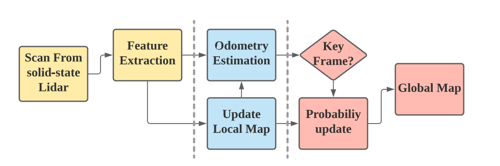

## SSL-SLAM的主要贡献
1. 提出用于固态雷达的完全SLAM框架，主要针对小视场、高刷新率的感知系统。
2. 提出了一种可以在大幅度旋转的情况下寻找一致特征的特征提取策略。
3. 方法的评估很全面，将L515装载到AGVs无人车上，在复杂的仓库环境中进行测试。结果表明可以实时建图，并在旋转的条件下鲁棒。

## 现有激光SLAM技术的不足

1. 由于一帧激光扫面包含的点云数量太多，直接进行点云匹配需要极大的计算资源，现有的激光SLAM都是在高计算资源、低更新频率的情况下进行。
2. 原始点云数据对于噪声十分敏感，很容易导致匹配精度的下降并造成漂移。

# SSL-SLAM的详细方法+理解
  
## 1. 特征提取

1）先移除噪声点(based on the measured distance)
    
根据观察，在最大探测距离附近的点总是因为低反射能量导致不那么准确，因此提前过滤掉这些噪声点。

2）计算边缘点和平面点

将点云投影到二维平面中，第$k^{th}$帧的扫描记为$P_k$,$点p_i=\{x_i,y_i,z_i\}\in P_k$,可以利用水平角和垂直角来表示。

$\alpha_i=arctan(\frac{{y_i}}{x_i})$

$\theta_i=arctan(\frac{{z_i}}{x_i})$

点云因此可以被固定在一个垂直探测范围$[\alpha_{min},\alpha_{max}]$和水平探测范围$[\theta_{min},\theta_{max}]$。然后将这个平面划分为$M*N$的单元格。

$M=\frac{\alpha_{max}-\alpha_{min}}{2*\alpha_r}$and$N=\frac{\theta_{max}-\theta_{min}}{2*\theta_r}$

划分结果如下图所示：

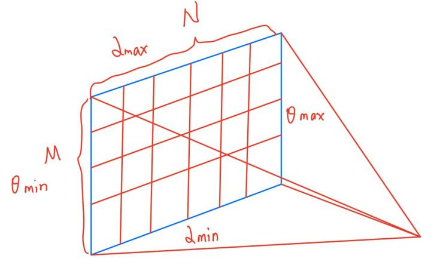

对于$(m,n)$单元格内的点，求取其坐标的平均值记为$P_k^{(m,n)}$。
**(该步骤实质为体素滤波)**

为了提取边缘点和平面点，利用附近的点计算局部平滑度。

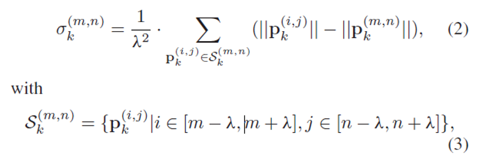

公式解析：

|  符号  | 含义  | 解释  |
|  ----  | ----  | ----  |
| $P_k^{(i,j)}$ | mean measurement of all points in the cell(i,j) | $(i,j)$单元格内的点的平均坐标 |
| $\lambda$ | a pre-defined searching radius | 预输入的搜索半径（统一值） |
|$\sigma_k^{(m,n)}$|the local smoothness|局部平滑度，值越大越锋利|

在实际计算过程中， 并不考虑$\lambda$的大小，直接计算该点与附近最相邻的10个点的空间距离之和。

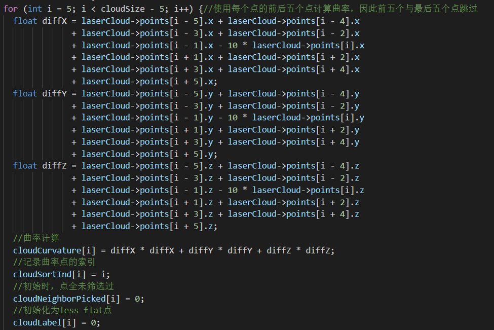

## 2. 里程计估计

目的是为了利用之前扫描的激光帧来估计机器人在世界坐标系中的当前位姿$T_k\in SE(3)$

单一帧与map相比包含的周围信息更少，因此在长距离建图中容易造成漂移。所以本系统采用的是scan-to-map的方式。

>### 地图匹配的分类
>

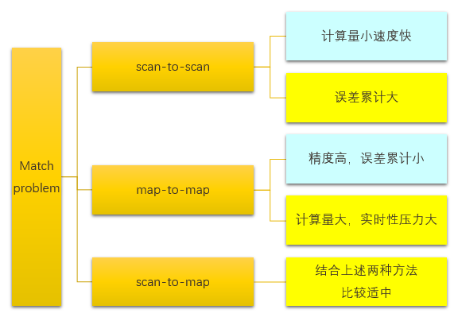

>1. scan-to-scan匹配
>
>即两帧激光雷达数据之间的匹配，目的是求得从起始帧A到目标帧B的相对平移量与旋转矩阵。目前来说scan-to-scan中，匹配效果最好的方法是ICP（Iterative Closest point迭代最邻近点算法）优点是计算量小速度快，缺点是误差累计大，长距离误差累计后地图就无法看了。
>
>2. map-to-map的匹配
>
>即地图与地图之间的匹配，优点是精度高，误差累计小；缺点就是计算量大，实时性压力大。
>
>3. scan-to-map的匹配
>
>即激光雷达扫描数据直接与地图进行匹配，这种方式一边计算位置，一边把新扫描到的数据及时加入到已有的地图中。他的优缺点都比较适中。

为了进一步的减少计算开销,匹配中的地图并不是完整的地图,而是局部地图(**即**$M_k={P_{k-1},P_{k-2}...P_{k-q}}$**构成的局部地图,$q$为自定义的构建局部地图的帧数)**

为了更进一步的减少计算开销,利用边缘点和平面点,在**特征空间**中进行匹配.

对于任意一个边缘点,有$p_k \in P_k$和与局部地图坐标系之间的转换矩阵$T_k$,根据公式$\hat{p_k}=T_k·p_k$,可以得到局部地图坐标系中最临近的对应点$\hat{p_k}$.

就这样将局部地图划分为**边缘点地图**与**平面点地图**,每个地图又被存储到K-D树中提高搜索效率.

$\hat{p_k}$在边缘点地图中找到两个最邻近的对应点$p_1^{\varepsilon}$和$p_2^{\varepsilon}$.并可以定义残差$f_\varepsilon(\hat{p_k})$.

$f_\varepsilon(\hat{p_k})=\frac{\vert(\hat{p_k}-p_2^\varepsilon)\times(\hat{p_k}-p_1^\varepsilon)\vert}{\vert(p_1^\varepsilon-p_2^\varepsilon)\vert}$

同理，$\hat{p_k}$在平面点地图中找到三个最邻近的对应点$p_1^{S}$.$p_2^{S}$和$p_3^{S}$.并可以定义残差$f_S(\hat{p_k})$.

$f_S(\hat{p_k})=\vert(\hat{p_k}-p_1^S)^T·\frac{(p_1^S-p_2^S) \times (p_1^S-p_3^S)}{ \vert (p_1^S-p_2^S) \times (p_1^S-p_3^S) \vert}\vert$

这两个残差的实质含义就是点到直线的距离和点到平面的距离。具体的证明过程如下：

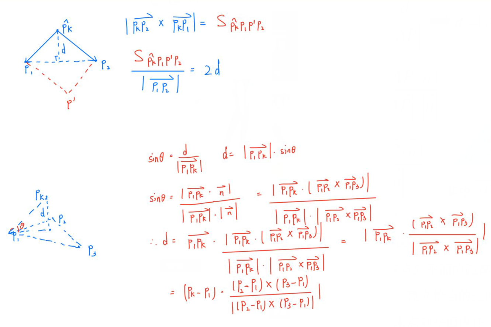

最终里程计的估计就是通过$f_\varepsilon(\hat{p_k})+f_S(\hat{p_k})$的最小值来确定：

$argmin_{T_k}\sum{f_\varepsilon(\hat{p_k})}+\sum{f_S(\hat{p_k})}$

这个非线性优化的问题，利用**高斯牛顿法**可以解决。

We use left perturbation scheme and apply increment on Lie Group.（左扰动方案，并在李群上运用增量）
与LOAM的差异化模型相比，优点：

(i) 旋转或位姿以无奇异性的格式存储;

(ii) 在每个迭代中进行无约束的优化;

(iii) 操作发生在矩阵层面，因此不需要担心取导数。

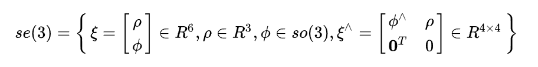

把每个$se(3)$元素记做$\xi$ ，它是一个六维向量：前三维为平移，记作$\varrho$ ；后三维是旋转，记作 $\phi$，实质上是$so(3)$ 元素。此外，在$se(3)$ 中， ^符号的含义被拓展了：这里它将一个六维向量转换为四维矩阵，但这里不再表示反对称矩阵。

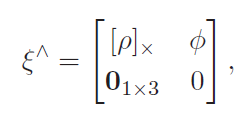

$[·]_{\times}$表示三维向量的倾斜矩阵。

根据左扰动模型和导数的定义可以计算：

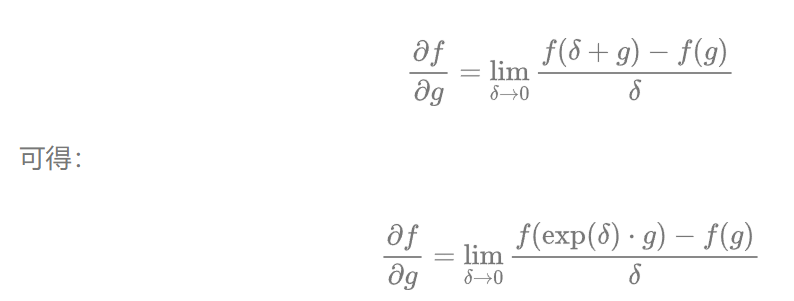

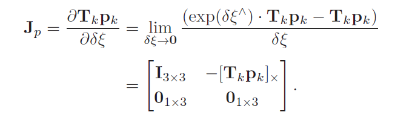

由此可以定义点到边缘残差的雅可比矩阵与点到平面残差的雅可比矩阵用于迭代求解：

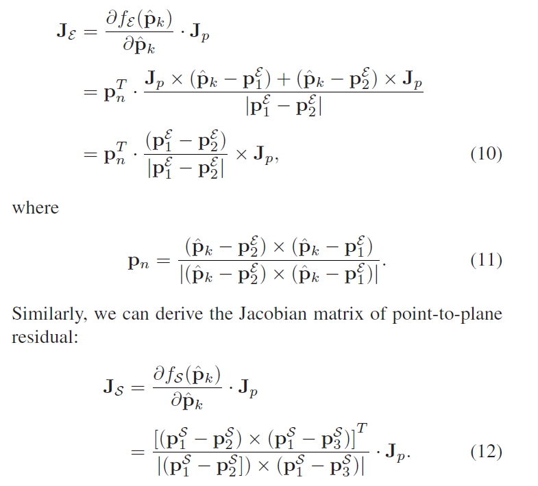

当前帧与局部地图的对其在最初可能不理想。最优的特征对应可以通过迭代的方式找到。

如通过初始位姿$T_k^0$和基于$T_k^0$的初始对应关系，我们就可以推导出里程计估计$T_k^1$、$T_k^2$、$T_k^3$。这样最后就可以收敛到对当前位姿的最佳估计。

需要明确：$T_k$是将第k帧数据转化到地图坐标系下的转移矩阵。

**$T_k$的初始位姿$T_k^0$的推导过程：**

作者假设相机的运动是恒定角速度并且线性平移的，所以在$k-2$到$k-1$帧之间的转移矩阵$T_{k-2}^{k-1}$可以适用于任意两帧之间。即：

$T_k^0=T_{k-1} · T_{k-2}^{k-1}$

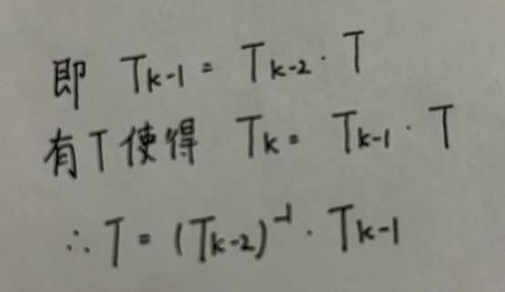

**用这样一个通过$T_{k-2}^{k-1}$预测出来的，有一定依据的$T_{k}$作为初始值$T_{k}^0$开始迭代，可以加速收敛的过程。**

$T_k^0=T_{k-1} · T_{k-2}^{-1}·T_{k-1}$

更为准确的写法为：$T_k^0=T_{k-1} · (T_{k-2})^{-1}·T_{k-1}$

利用高斯牛顿迭代法求取最优转移矩阵$T_k$的算法流程图为：

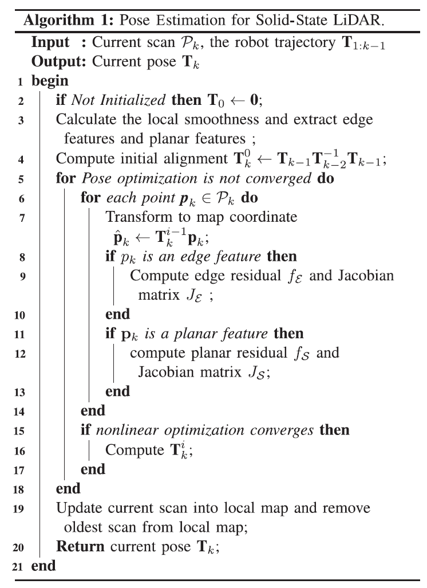

## 3. 概率图构建

由于地图比较大，所以为了计算效率，不是每一帧都会进行更新，而是选择**关键帧**进行更新和地图重建。

关键帧选取原则：

1）机器人的位移大于阈值

2）旋转角度大于阈值

3）所经过的时间大于阈值

为了加快搜索效率，采用**八叉树**来存储全局地图。

利用$P(n|z_{1:t})$来表示一个对象存在的概率。

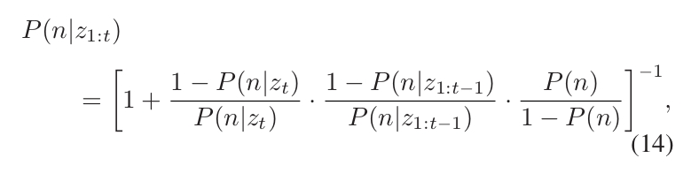

$Z_t$是现在的测量值，$z_{1：t-1}$是关键帧的历史测量值，$P（n）$是先验概率，未知区域为$0.5$.

# 附加内容
## 固态雷达和机械雷达的区别
1. 机械式激光雷达
   
特点：激光发生器竖直排列并可以360°旋转，通过旋转对四周环境进行全面的扫描。

优点：可以通过物理旋转进行3D扫描，对周遭环境进行全面的覆盖形成点云。其次是分辨率高。

缺点：高频的转动和复杂的机械结构致使其平均的失效时间仅1000-3000小时。

2. 纯固态激光雷达
   
相比机械式激光雷达，固态激光雷达仅面向一个方向一定角度进行扫描，覆盖范围有所限制。但取消了复杂高频转动的机械结构，耐久性得到了巨大的提升，体积也可以大幅缩小。

纯固态激光雷达主要包括OPA光学相控阵和Flash闪光激光雷达两种。

- OPA光学相控阵

相控阵雷达发射的是电磁波，同样也是波的一种，波与波之间会产生干涉现象。通过控制相控阵雷达平面阵列各个阵元的电流相位，利用相位差可以让不同的位置的波源会产生干涉，从而指向特定的方向。往复控制相位差便可以实现扫描的效果。

- Flash闪光
  
特点：不是通过扫描的方式，而是在短时间内直接向前方发射出一大片覆盖探测区域的激光，通过高度灵敏的接收器实现对环境周围图像的绘制。Flash激光雷达的原理类似于拍照，但最终生成的数据包含了深度等3D数据。是目前纯固态激光雷达最主流的技术方案。

缺点：由于短时间内发射大面积的激光，因此在探测精度和探测距离上会受到较大的影响，主要用于较低速的无人驾驶车辆，例如无人外卖车、无人物流车等，对探测距离要求较低的自动驾驶解决方案中。

3. 混合固态激光雷达
   
混合固态激光雷达是前两者的折中方案，相较机械式激光雷达，混合固态激光雷达也只扫描前方一定角度内的范围，而相比纯固态激光雷达，混合固态激光雷达也有一些较小的活动部件。不过混合固态激光雷达在成本、体积等方面更容易得到控制。

- **MEMS微振镜（L515属于这种）**

MEMS微振镜是通过控制微小的镜面平动和扭转往复运动，将激光管反射到不同的角度完成扫描，激光发生器本身固定不动。

优点：尺寸小、可靠性高、成本低。

缺点：信噪比低，和有效距离短等问题。增大镜面尺寸可以有效增加MEMS激光雷达的精度，但最大偏转角度也会因此受限，FOV视场角会更加受限。

- 转镜

优点：转镜是反射镜面围绕圆心不断旋转。转镜在功耗、散热等方面有着更大优势。

缺点：存在信噪比低，和有效距离短，FOV视场角受限等问题。
- 棱角

棱镜激光雷达也称为双楔形棱镜激光雷达，内部包括两个楔形棱镜，激光在通过第一个楔形棱镜后发生一次偏转，通过第二个楔形棱镜后再一次发生偏转。控制两面棱镜的相对转速便可以控制激光束的扫描形态。

优点：只要棱镜的相对速度控制得当，在同一位置长时间扫描几乎何以覆盖整个区域。相比MEMS微振镜和转镜方案，棱镜激光雷达可以通过增加激光线束和功率实现更高的精度和更远的探测距离，不过机械结构也相对更加复杂，体积叫前两者更难以控制，存在轴承或衬套的磨损等风险。

缺点：存在中心区域点云密集。两侧点云相对稀疏的情况。

## L515硬件

特点：捕获深度0.25-9m、200万像素RGB镜头、深度图分辨率$1024*768(30FPS)$、$FoV(70° × 55° (±2°))$、RGB图$1920*1080(30FPS)(70°±3 × 43°±2)$

深度相机的四种设置：

1. Max Range(最大范围):在场景中没有环境光时非常有用（完全在室内使用的情况下，没有光从窗户进来）。在该设置下，激光功率被设置为最大，接收器的增益也被设置为最大，从而优化室内条件下的深度质量。
2. Short Range(短范围):降低了激光功率和增益，使近距离的物体不会让接收器过饱和。该设置允许让雷达在离物体很近的地方操作。
3. No Ambient Light(无环境光):与Max Range相同,在场景中没有环境光时非常有用,区别在于该设置下激光功率较低，用来避免在距离超过模糊范围的物体上出现虚假深度。
4. Low Ambient Light(低环境光):建议用于可能有少量环境光、阳光存在的环境。与Max Range预设类似，激光功率被设置为最大，但接收器的增益被降低，以避免因环境阳光而使摄像机饱和。该预设也被推荐用于用户希望探测近距离物体（<50厘米）的情况。

图像存储格式：YUY2
