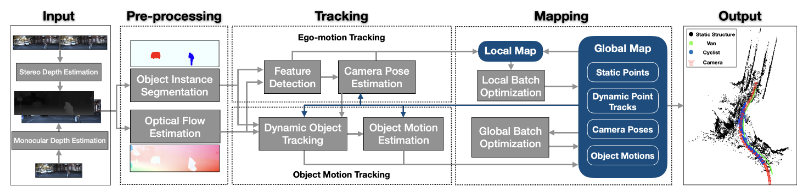

#  VDO-SLAM: A Visual Dynamic Object-aware SLAM System论文笔记
作者：Jun Zhang, Mina Henein, Robert Mahony and Viorela Ila
机构：The Australian National University（ANU），University of Sydney

Jun Zhang现在在KTH Royal Institute of Technology担任博士后，主要工作在利用侧扫声纳（side-scan sonar，SSS）和多波束回声测深仪（multibeam echo sounders，MBES）研究AUV水下SLAM

共一Mina Henein主要从事动态环境中的SLAM研究

本文目前在arXiv上，未收录。代码开源：https://github.com/halajun/vdo_slam

相关文章：DynaSLAM II: Tightly-Coupled Multi-Object Tracking and SLAM（RAL2021）

SLAM算法的静态刚体假设非常常见，这也限制了SLAM的很多应用场景

传统方法解决动态场景SLAM：
1. 将任何与移动物体相关的传感器数据作为异常值，将其从估计过程中删除从估计过程中去除
2. 删除动态物体并且利用多目标跟踪方法分别跟踪

所以传统的方法是不包含场景中的动态物体的，仅用静止点生成地图。

常用的场景运动估计方法：1)optical flow estimation 2)Scene Flow Estimation

本文的前沿工作：
1)Dynamic SLAM：The Need For Speed  (2020, ICRA)
2)Robust Ego and Object 6-DoF Motion Estimation and Tracking (2020,IROS)

本文贡献：
- 提出了一种能够在动态场景下实现机器人的位姿估计，构建静态环境地图，实现动态对象的运动估计的统一的框架。

- 动态物体SE（3）姿态变化的精确估计，优于最先进的算法，以及提出计算场景中移动物体速度的方法，

- 一种利用语义信息跟踪运动对象的稳健方法，能够处理语义对象分割失败导致的间接遮挡等问题，

- 在复杂真实的场景中演示了该系统。

# 系统框架

输入为立体像对或RGB-D图像，对于立体像对利用Efficient Joint Segmentation,Occlusion Labeling, Stereo and Flow Estimation（2014  ECCV）提出的方法获取深度信息。
由于本文尝试基于图像的语义信息，所以输入转变为单目RGB图像，对单目RGB图像进行深度估计。

## 图像预处理

1. 如何鲁棒地分割静态背景和物体？
    
    实例分割可以用于识别出场景中潜在的运动物体，语义信息可以提供先验知识，如：建筑物和道路总是静止的，汽车是可动可静的。

2. 如何对动态物体进行长期地跟踪？

    利用光流估计，由于大部分运动物体只占据了图像的很小一部分，所以利用稀疏的特征匹配无法保证长期地跟踪。本文提供的方法是对语义掩码上的点进行采样，显著增加物体上的点的数量，生成的密集光流来最大程度地保证跟踪。

## 跟踪

包括两个模块：相机自身运动跟踪（特征检测和相机位姿估计子模块）和目标运动跟踪（动态目标跟踪和目标运动估计子模块）

- 特征检测

为了实现快速的摄像机姿势估计，我们检测一组稀疏的角部特征，并通过光流跟踪它们。在每一帧中，只有符合估计的摄像机运动的离散特征点被保存到地图中。

- 相机位姿估计

利用3D-2D静态点的对应关系可以计算出

- 目标运动跟踪

经过实例分割的物体被分类为静态和动态两类，然后通过连续帧将动态物体关联在一起。
