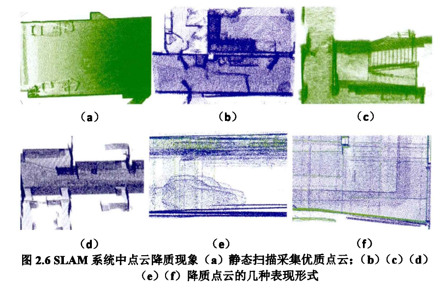

# 基于深度学习的激光扫描SLAM三维点云质量评价 论文笔记
作者：李根  2018年厦门大学硕士学位论文 

## 为什么要进行点云质量评价
   1. 在实际测量中，激光扫描获得的三维点云地图精确程度不同，在实际测量的过程中，点云会存在不同的降质现象，获取准确的点云地图非常重要。
   2. 点云的质量与SLAM算法结果的准确性密切相关，能反映SLAM算法的优劣。

## 工作难点
1. 降质的原因比较复杂，之前常用的是采用数据对比的方法，比较生成点云与实际地图的差别。
2. 对点云质量的分析没有完整的框架和系统。
3. 由于数据的多样性和SLAM算法差异，仅使用SLAM算法生成的轨迹评判标准估计SLAM准确性不够客观。
4. 开源数据集较少，一般只有通过SLAM系统生成的优质点云，较差的降质点云数据来源很少。

## 常见的点云评价方法
1. 测量噪声水平：通常围绕物体边缘进行测量。 
 Anna提出一种小波变换的方法[2]； Zhang通过对降采样后的3D点云进行人工的主观评价[3]
2. 评价模型的拼接和配准方面。
3. 分析物体的空间三维结构的投影来判断点云数据质量的好坏。

在测量领域，需要设置标靶。利用控制点对点云进行位置校正，一方面可以量化点云数据噪声水平，另一方面可以对测量误差进行校正，

## 深度学习在三维点云上的现状
### 在3D点云上不够成熟的原因
1. 点云的无序性。一般需要将点云进行体素网格化变为有序的再进行训练，但训练参数和所需的网络模型也大大增加。
2. 点之间的空间关系。 
3. 点云对于某些变换具有不变性。

## 获取室内点云数据的方法
 1. 结构光法：通过透射特定光，如激光、红外光到物体表面，根据物体造成光的不同来计算物体位置。（易受光照影响）
 2. TOF系统，基于时间测距，向物体发射脉冲激光束，根据接收机测量信号从扫描对象返回到检测器的时间计算距离来计算环境。响应时间快，不易受光源限制。（单位时间内对物体分辨性能差）
 3. 双目测距法，利用双摄像头得到两张图象，再根据相机内参估计物体距离。（精度较差，易受环境干扰，相机内参不够准确）
 4. CAD模型生成点云，预先绘制3D模型，然后通过算法逆向生成点云。（真实性不足）

## 点云分类

作者提出两类点云类型：优质点云和降质点云。

优质点云：室内点云场景具有完整建筑几何结构信息，与现实室内建筑模型能基本重合，数据噪声与误差较小，符合实际室内模型结构。

降质点云：由于扫描过程和物体对激光反射程度误差等引起的点云数据大量噪声和冗余，显著残缺。

在降质点云中又分为：
- 局部降质：将得到的点云地图根据区域划分为多个子集，在每个子集中，与实际进行对比，如果存在局部区域点云密度明显较大/较小，则点云在该区域噪声水平较高。表现为点云明显冗余/明显稀疏不完整。（明显分层、重叠区域叠加、墙面与地面不垂直、天花板与地面不平行等，产生该类局部降质的主要原因在于SLAM系统运动估计中平台的突变产生跟踪丢失）
- 全局降质：党点云的数据噪声以及几何结构异常存在于整片点云中时，就是全局降质的表现。（主要是在后端优化、闭环检测等步骤由于算法失效or累计误差等原因造成的）

降质的原因总结：
1. 局部区域遮挡和视角限制引起数据缺失
2. 人群、车辆移动等室内环境短时间内变化较大引起数据干扰和点云误匹配
3. 测量平台移动太快或太慢引起跟踪丢失造成配准问题及点云信息丢失
4. SLAM算法的运动估计、图优化、闭环检测等步骤失效。
   

由于SLAM获取的点云是经过算法优化的点云，引起上述4中，SLAM算法造成的误差是点云降质现象中最主要的来源。
## 室内点云质量标准分析

在评估室内点云质量的过程中有客观与主观两种方法：依照观测者认为评分的方法进行评估属于主观评价，通过数据分析和验证的方式进行评价属于客观评价，根据认为介入的程度，分为有参考评价和无参考评价。

本文提出的一种通过数据分析的方法，分为三个步骤：
1. 室内平面结构的分割：室内建筑框架结构如墙面、地面、天花板、门窗等不易发生改变，属于刚性的平面结构。由于SLAM系统的航迹偏移和累计误差会造成这些平面刚体结构的误差。
2. 局部一致性噪声分析
3. 几何结构对应规则分析

预处理过程：在激光雷达移动测量的过程中会产生部分区域点云较密集，部分区域稀疏的情况，对于大片点云来说，稍微降低点云密度不会对点云特征产生影响。为了减小点云密度不均衡的情况，对点云进行降采样工作，将点云统一到相似分辨率下。本文采用的方法是对点云进行网格空间划分，只保留网格区域中心点，然后根据平面所属空间对点云数据进行聚类分割（RANSAC）。

RANSAC拟合平面博客：
https://www.cnblogs.com/xrwang/archive/2011/03/09/ransac-1.html

1. 利用RANSAC进行平面结构分割，将室内三维空间结构作为有规则的平面的集合，并通过K-dtree紧邻关系，对局内点进行平面聚类，将室内结构划分为平面集。
2. 局部一致性噪声分析：计算所有点到所属平面的距离$D_i$，令$D_i$小于给定的距离阈值，满足的点数为$n_{inter}$

（2.2）和（2.3）都可以是一种噪声度量规则。

3. 几何对应分析：若两平面之间是垂直的，则几何质量越高。

从数据噪声和几何特性两个方面对点云质量进行量化分析。

**理论上，这种方法可以对大部分室内点云进行评估，但是这种算法过于依赖平面提取的准确性，并且算法效率不高，对于局部点云缺失现象无法进行有效评估。**

## 基于PointNet++网络的室内点云质量分类

通过深度学习网络学习优质和降质两类现象的点云特征，针对特征进行质量分类，将点云质量问题转化为分类问题。

## 问题
1. 由于降质点云的情况在实际场景中比较复杂，所以通过仿真的方法生成的点云数据真实性不足，难以涵盖所有情况。
2. 只能适用于室内环境中仅存在简单的建筑模型结构，鲁棒性不足。
3. 局部失真的区域较小的情况难以进行判别。

